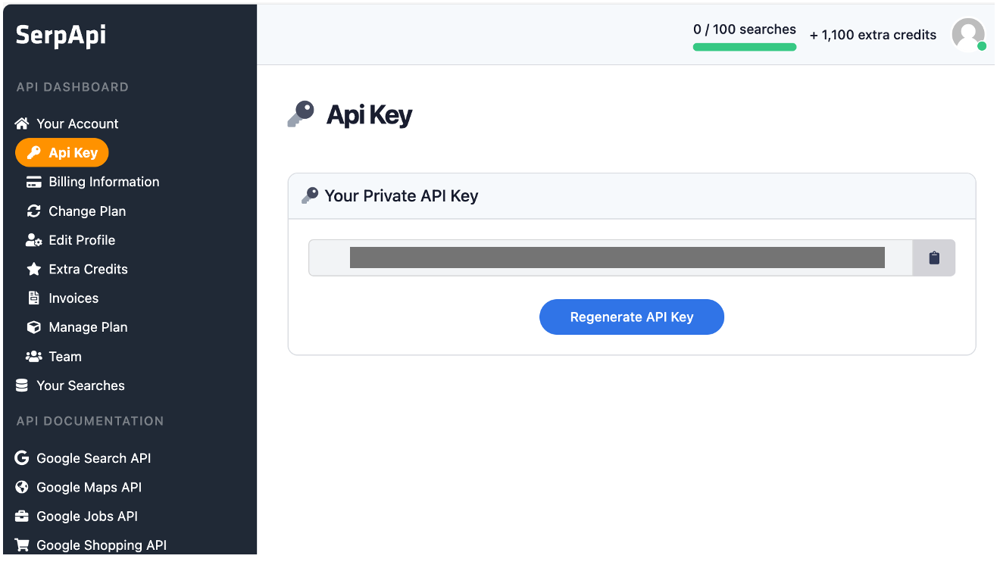

# BingSearch Flow

---

## 프롬프트 흐름

In this flow, you will configure a node that enables real-time external information retrieval using Bing Search.

---

### Serp API 가입방법

1. **Serp API 사이트 접속**
	- [https://serpapi.com/](https://serpapi.com/)에 접속합니다.
	- 로그인합니다. 계정이 없으면 새로 생성합니다.

2. **Serp API 키 확인**
	- Api Key 메뉴에서 키를 확인합니다.
	- 월 100회 무료 사용 가능합니다.

