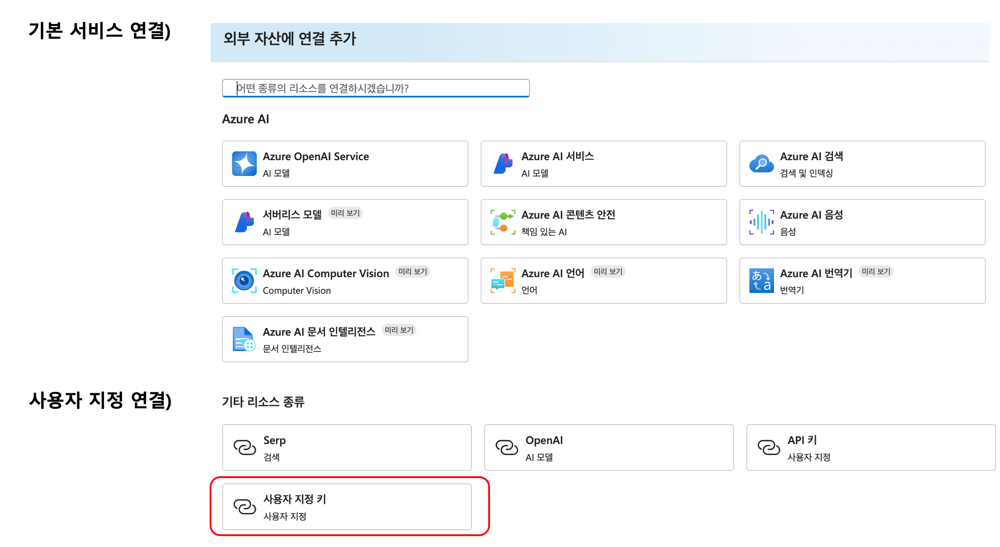
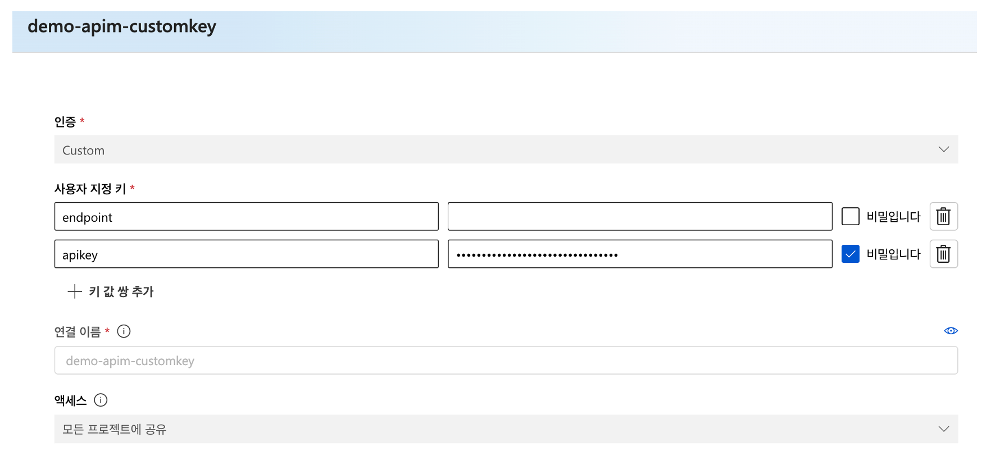
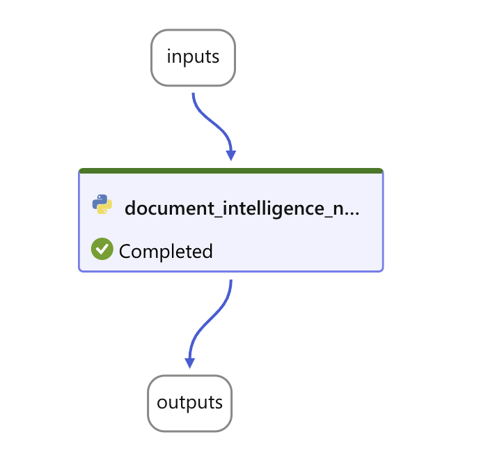

# Custom Connection for DI(Document Intelligence)

## Custom Connection 연결방법

## 프롬프트 흐름

## 코드설명
- document_intelligence_node.py : DI 정보를 costomconnection인 conn 변수로 대체, conn 변수는 입력값에서 선택
- requirements.txt : 패키지 등록 후 설치