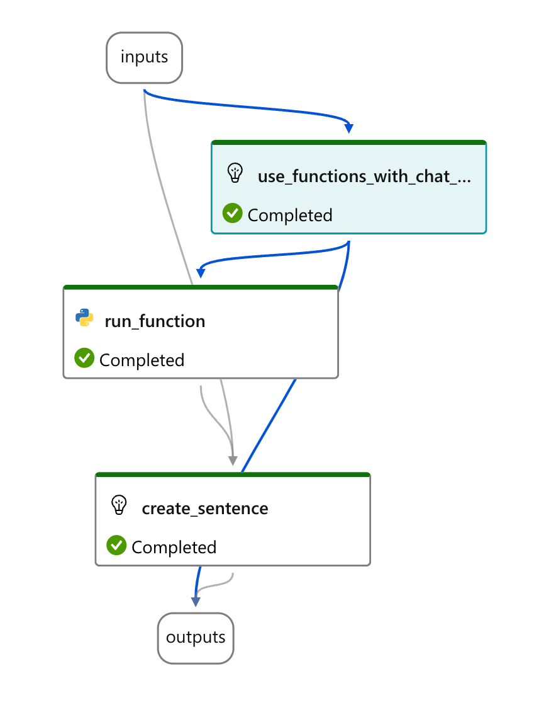
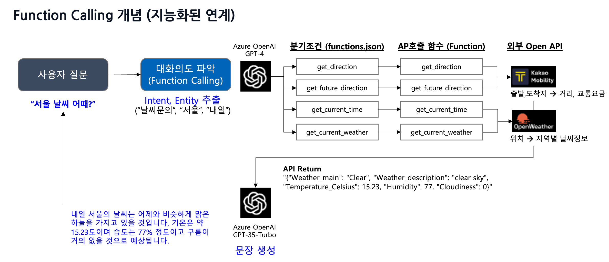
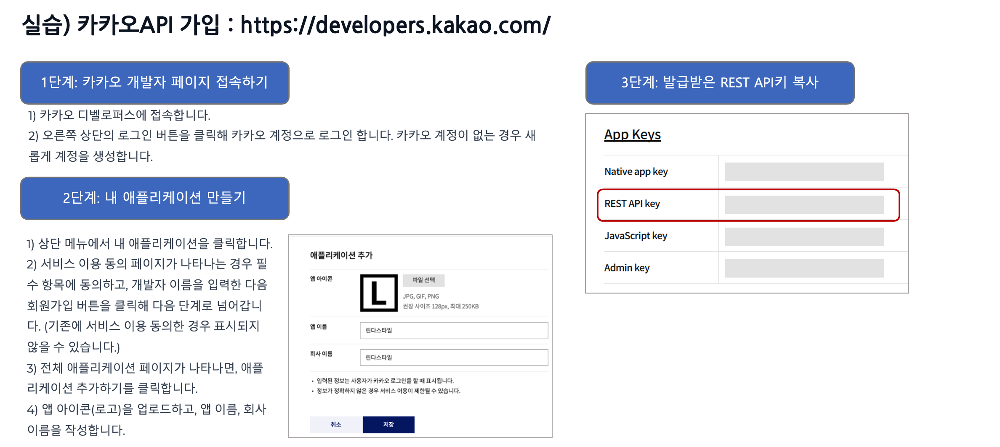
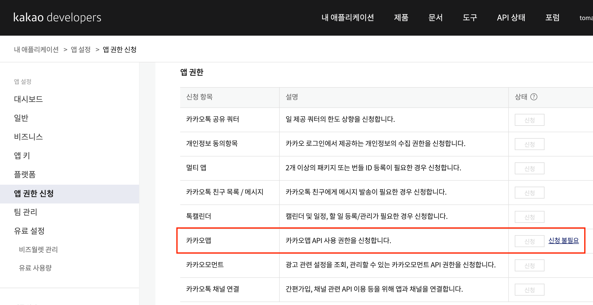

# Use Functions with Chat Models

---

## 프롬프트 흐름

This flow explains how to use the LLM chat API in combination with external functions to enhance the capabilities of GPT models.

---

### Function Calling 개념

---

### Kakao API 가입방법

1. **카카오 개발자 페이지 접속**
   - [https://developers.kakao.com/](https://developers.kakao.com/)에 접속합니다.
   - 카카오 계정으로 로그인합니다. 계정이 없으면 새로 생성합니다.

2. **애플리케이션 생성**
   - "내 애플리케이션" 메뉴에서 새 애플리케이션을 생성합니다.
   - 애플리케이션 이름과 정보를 입력한 후 등록합니다.

3. **REST API 키 확인**
   - 생성된 애플리케이션의 설정 화면에서 "App Keys" 섹션으로 이동합니다.
   - REST API 키를 복사하여 사용합니다.
   - 앱권한신청메뉴 : 카카오맵 권한 확인, "신청필요"로 조회되면 "활성화"로 변경

 

---

### Function 사용 개요

The `functions` parameter is an optional feature in the <a href='https://platform.openai.com/docs/api-reference/chat/create' target='_blank'>Chat Completion API</a> that allows developers to provide function specifications. This feature enables models to generate function arguments that adhere to the provided specifications. 

- **Execution Note**: The API does not execute the functions; developers must execute them using the model outputs.
- **Controlling Function Calls**:
  - To force a specific function: Set `function_call` to `{"name": "<function-name>"}`.
  - To disable function calls: Set `function_call` to `"none"`.
- **Output Behavior**: If a function is used, the response includes `"finish_reason": "function_call"` and a `function_call` object containing the function name and arguments.

For more details, refer to the <a href='https://github.com/openai/openai-cookbook/blob/main/examples/How_to_call_functions_with_chat_models.ipynb' target='_blank'>OpenAI sample</a>.

---

## What You Will Learn

In this guide, you will learn:
1. How to integrate functions with LLM chat models.
2. How to compose function role messages in a prompt template.

---

## Tools Used in This Flow
- **LLM Tool**: For handling large language models.
- **Python Tool**: For developing and testing function calls.

---

## References
- <a href='https://github.com/openai/openai-cookbook/blob/main/examples/How_to_call_functions_with_chat_models.ipynb' target='_blank'>OpenAI Cookbook Example</a>
- <a href='https://openai.com/blog/function-calling-and-other-api-updates?ref=upstract.com' target='_blank'>OpenAI Function Calling Announcement</a>
- <a href='https://platform.openai.com/docs/guides/gpt/function-calling' target='_blank'>OpenAI Function Calling Guide</a>
- <a href='https://platform.openai.com/docs/api-reference/chat/create' target='_blank'>OpenAI Function Calling API</a>