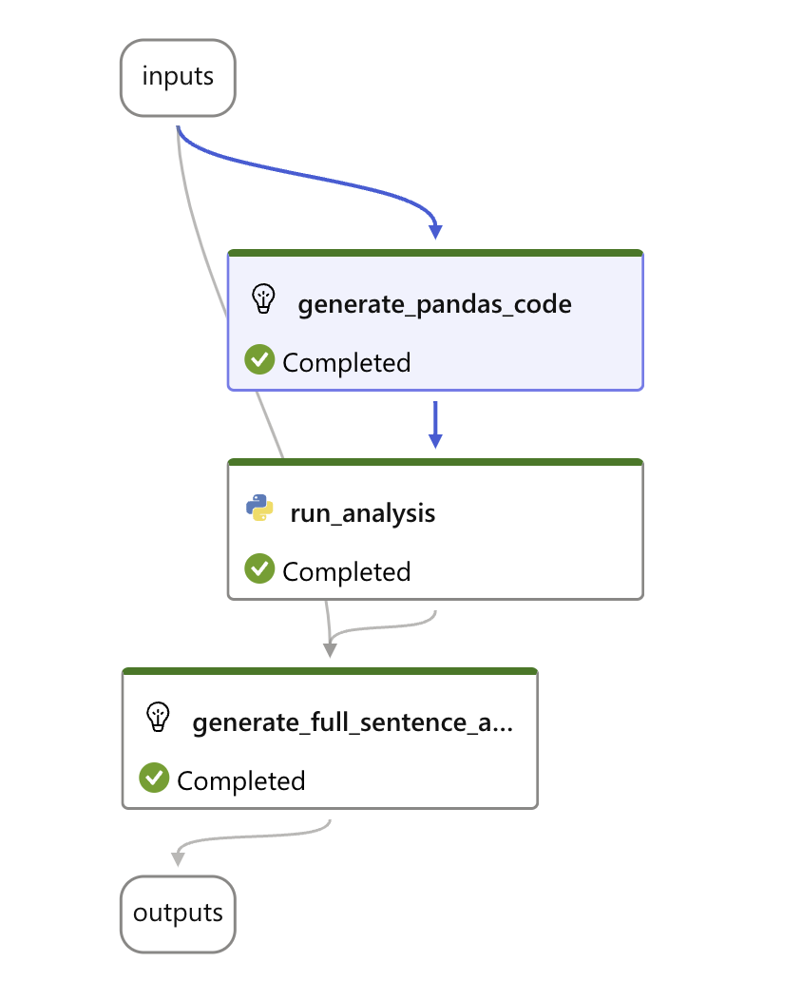
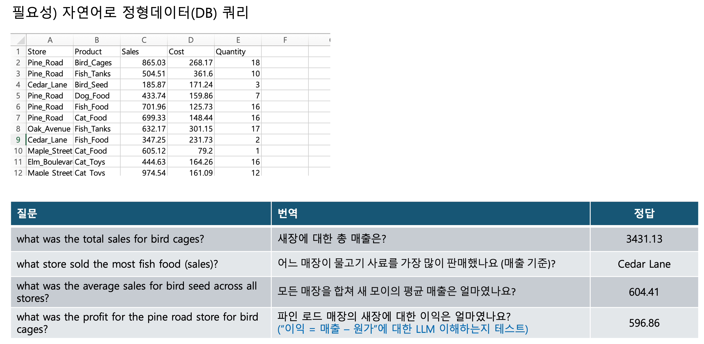

# 자연어 Query Flow (정형데이터 분석)

## 프롬프트 흐름

## 흐름 설명

### 준비작업
- requirements.txt 파일 복사
- genrate_pandas 노드 : chat.jinja2 템프릿 복사
- run_analysis.py 노드 : 코드 복사
- generate_full_sentence_answer 노드 : jinja2 템플릿 프롬프트 복사